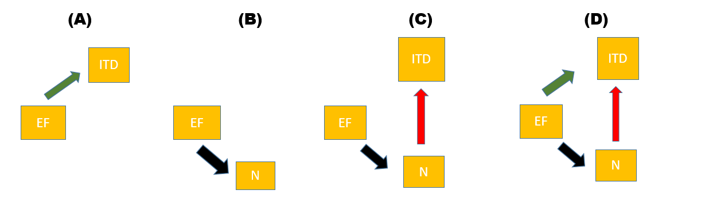

```{r setup, include=FALSE}
knitr::opts_chunk$set(echo = FALSE, 
                      message = FALSE,	
                      warning = FALSE)
options(htmltools.dir.version = FALSE)
library(emojifont)
library(mvtnorm)
library(tidyverse)
library(grid)
library(png)
library(gridExtra)
library(ggpubr)
library(gganimate)
load("Data/TwoDimensionSimulationResults.RData")
```

background-image: url(pics/esalogo.png)
background-position: 4% 2%
background-size: 250px

class: inverse, right

## Measuring intraspecific diversity: <br> a critical assessment of methods

#### Oluosji O.D. $^{1,2}$, Spaak J. $^1$, Neyens T. $^2$, Fontana S. $^3$, <br> Aerts M. $^2$, De Laender F. $^1$

<br>
<br>
<br>
<br>
<br>

Environmental and Evolutionary Biology (URBE), Univeriste De Namur $^1$, <br> Center for Statistics, Universiteit Hasselt  $^2$, <br> Swiss Federal Institute for Forest, Snow and Landscape Research, Birmensdorf $^3$

<br>
<br>

<div style="text-align: center">
 <pr            >
   <pr                 >
 
</div>

---

# Intraspecific Diversity (ITD)

.pull-left[

## Intraspecific Diversity, what is it?

* `r emo::ji("cow")` - Species One, `r emo::ji("camel")` - Species Two

```{r, fig.asp=0.93}
set.seed(3435)
#species one
x1 <- rmvnorm(25, mean = c(5, 5), sigma = diag(0.5, nrow = 2, ncol = 2))
#species two
x2 <- rmvnorm(25, mean = c(5.5, 8.5), sigma = diag(0.75, nrow = 2, ncol = 2))
plot(x1, type = "n", xaxt = "n", yaxt = "n", bty = "l", xlab = "", ylab = "", 
     ylim = c(min(x1[,2], x2[,2]), max(x1[,2], x2[,2])), 
     xlim = c(min(x1[,1], x2[,1]), max(x1[,1], x2[,1]))
     )
axis(side = 1, labels = F, col.ticks = NA)
axis(side = 2, labels = F, col.ticks = NA)
mtext("Trait 1", side = 1, line = 0)
mtext("Trait 2", side = 2, line = 0)
#random sampling for coloring
s1 <- sample(x = 1:25, size = 25/2)
s2 <- setdiff(1:25, s1)
#species one
#text(x1[s1, ], pch = 21, col = "purple3", cex = 1.7, labels = emoji('cow'))
#text(x1[s2, ], pch = 21, col = "red3", cex = 2.0, labels = emoji('cow'))
text(x1[which(x1[, 1] >= mean(x1[, 1])), ], col = "gray0", cex = 1.7, labels = emoji('cow'))
text(x1[which(x1[, 1] < mean(x1[, 1])), ], col = "darkgrey", cex = 1.7, labels = emoji('cow'))
#text(x1[which(x1[, 2] == min(x1[, 2])), ], pch = 22, col = "whitesmoke", bg = "purple3", cex = 1.7)
#species two
text(x2[s1, ], col = "chocolate2", cex = 1.7, labels = emoji('camel'))
text(x2[s2, ], col = "chocolate4", cex = 1.7, labels = emoji('camel'))
```

]

--

.pull-right[

## Importance & Facets of ITD

* **pivotal role in ecosystem mechanisms and dynamics** (De Laender et al., 2014)

* `Richness` (what amount of the trait space is occupied by individuals of this species?) 

* `Evenness` (how is the trait space filled up by these individuals?) 

* `Divergence` (any form of trait differentiation across these individuals?)

]

---

# How is ITD Measured?

* You guessed right! It is done via indices `r emo::ji('smile')`

--

![:col_header Trait Richness, Trait Evenness, Trait Divergence]
![:col_list `FRic` (Villeger et al. 2008), `FEve` (Villeger et al. 2008), `Rao` (Rao 1982)]
![:col_list `TOP` (Fontana et al. 2016), `TED` (Fontana et al. 2016), `FDis`  (Lalibert & Legendre 2010)]

--

### TOPM & TEDM

.pull-left[

```{r, fig.asp=0.70}
set.seed(1992)
sceneraio_2 <- as.data.frame(rescale(rmvnorm(20, mean = c(5, 5), sigma = matrix(c(0.85, 0.005,0.005, 0.85), 
    nrow = 2, ncol = 2))
  )
)

i <- 1

p1 <- ggplot(sceneraio_2, aes(x = V1, y = V2)) + 
  geom_point(size = 3, col = 2) + 
  theme_pubr() + 
  scale_x_continuous(labels = NULL, minor_breaks = NULL) + 
  scale_y_continuous(labels = NULL, minor_breaks = NULL) + 
  theme(axis.ticks = element_blank()) + 
  labs(x = "Trait 1", y = "Trait 2")

while(TRUE) {
    i <- i+1
    covhull <- chull(sceneraio_2)
    p1 <- p1 + geom_polygon(data = sceneraio_2[covhull, ], size = 0.9, 
                            alpha = 0.1, color = i, fill = NA)
    sceneraio_2 <- sceneraio_2[-covhull, ]
    if(nrow(sceneraio_2) <= ncol(sceneraio_2)) { break}
}

p1 <- p1 + 
  annotate("text", x = 0.6, y = 1.09, hjust = 0, 
           label = '"TOP = " * phantom("Area1") * "+" * phantom("Area2") * "+" * phantom("Area3")', 
           color = 1, parse = T) + 
  annotate("text", x = 0.6, y = 1.09, hjust = 0, 
           label = 'phantom("TOP = ") * "Area1" * phantom("+") * phantom("Area2") * phantom("+") * phantom("Area3")', 
           color = 2, parse = T) + 
  annotate("text", x = 0.6, y = 1.09, hjust = 0, 
           label = 'phantom("TOP = ") * phantom("Area1") * phantom("+") * "Area2" * phantom("+") * phantom("Area3")', 
           color = 3, parse = T) + 
  annotate("text", x = 0.6, y = 1.09, hjust = 0, 
           label = 'phantom("TOP = ") * phantom("Area1") * phantom("+") * phantom("Area2") * phantom("+") * "Area3"', 
           color = 4, parse = T) + 
  annotate("text", x = 0.69, y = 1.01, label = expression(paste("TOPM = ", frac(TOP, N)))
                                                         )
print(p1)
```

]

.pull-right[

```{r, fig.asp=0.78}
s1 <- base_traitmatrix("cube", ncols = 2, dsize = 200)
s12 <- matrix(NA, nrow = 200, ncol = 2)
s12 <- apply(s12, 2, function(x)runif(200, 0, 1))

par(mfrow = c(1, 2))
plot(s1, ylab = "", xlab = "", xaxt = "n", yaxt = "n", bty = "l", pch = 19, col = 1, 
     main = "TED")
axis(side = 1, labels = F, col.ticks = NA)
axis(side = 2, labels = F, col.ticks = NA)
mtext("Trait 1", side = 1, line = 1)
mtext("Trait 2", side = 2, line = 1)

plot(s12, ylab = "", xlab = "", xaxt = "n", yaxt = "n", bty = "l", pch = 19, col = 1, 
     main = "TEDM")
axis(side = 1, labels = F, col.ticks = NA)
axis(side = 2, labels = F, col.ticks = NA)
mtext("Trait 1", side = 1, line = 1)
mtext("Trait 2", side = 2, line = 1)

covhull2 <- chull(s12)
polygon(s12[covhull2, ], lwd = 2, border = 2)
```

]


---

# What Should be Expected of ITD Indices?

--

1. Mathematically acceptable and embodies the logic of its creation `r emo::ji("thumbs_up")`

--

2. Conforms with established intuition `r emo::ji("thumbs_up")`

--

3. **`Measures pure ITD`** `r emo::ji("grimace")` `r emo::ji("question")`

--


---

# Simulation Framework

.pull-left[

### Case 1

```{r, fig.asp=0.80}
img1 <- readPNG("pics/Scenarios_Setup1.PNG")
grid.raster(img1)
```

* Across Scenarios; 
  - $\uparrow$ `Richness`
  - $\uparrow$ `Divergence`
  - $\downarrow$ `Eveness`

]

.pull-right[

### Case 2

```{r, fig.asp=0.80}
img2 <- readPNG("pics/Scenarios_Setup22.PNG")
grid.raster(img2)
```

* Across Scenarios; 
  - $\downarrow$ `Richness`
  - $\uparrow$ `Divergence`
  - $\downarrow$ `Eveness` `r emo::ji("grimace")`

]

---

# Simulation Framework (Cont.)

- `Case 3` $-$ Add more and more individuals to the trait space
  * $\rightarrow$ `Richness`, `Divergence`, `Eveness`

.pull-left[
### Case 4(TED, TEDM)

```{r, fig.asp=0.80}
img3 <- readPNG("pics/Scenario2_Uniform.PNG")
grid.raster(img3)
```

- $\downarrow$ `Eveness` `r emo::ji("smile")`
]

.pull-right[
### Case 5(TOP, TOPM)

```{r, fig.asp=0.80, cache=TRUE}
x1 <- rep(1:5,each=5)
x2 <- rep(1:5,times=5)
X <- cbind(x1,x2)

a <-  X[(X[, 1]==3 & X[, 2]==3), 2] #<- 3.5
b <- X[(X[, 1]==3 & X[, 2]==3), 1] #<- 2.5
rest2 <- rest <- c(); position <- c()
i <- 0
X2 <- X
toplot <- data.frame()
while(a >= 1 & b >= 1) {
  X2[(X[, 1]==3 & X[, 2]==3), 2] <- a
  X2[(X[, 1]==3 & X[, 2]==3), 1] <- b
  b <- b - 0.05
  a <- a - 0.05
  i <- i + 1
  if(a < 1 & b < 1) break
  toplot <- rbind(toplot, data.frame(x1 = a, x2 = b)
  )
}

toplot$steps <- 1:nrow(toplot)
#par(mfrow = c(1,2))
#plot(X, pch = 19, col = 2, xlab = "Trait 1", ylab = "Trait 2", bty = "l")
#points(X[13, 1], X[13, 2], col = "blue", pch = 19)

#arrows(x0 = 3, y0 = 3, x1 = 4.5, y1 = 4.5, 
#       angle = 45, length = 0.30, lty = 2, lwd = 2.5, col = 6)

ggplot(data = as.data.frame(X), aes(x = x1, y = x2)) + 
  geom_point(color = "red", size = 2.5) + 
  geom_point(aes(x = x1[13], y = x2[13]), color = "blue", size = 2.5) +
  labs(x = "Trait 1", y = "Trait 2") + 
  theme_pubr() +
  geom_segment(data = as.data.frame(X), aes(x = 3, xend = 1.5, y = 3, yend = 1.5), 
               arrow = arrow(angle = 45), 
               linetype = 2, color = 6) +
  geom_point(data = toplot, aes(x = x1, y = x2), color = "blue", size = 2.5) +
  transition_states(steps, transition_length = 1,
                      state_length = 1) + 
  ease_aes('linear') +
    enter_fade() +
    exit_fade()
```

- `Richness` `r emo::ji("man_shrugging")`
]

---

# Results

.pull-left[

### Case 1

```{r, cache=TRUE}
Comm_every <- tibble(mu_change = delta_mu, Sim_Results = Results_comm) %>%
  mutate(
        Average = lapply(Sim_Results, function(x) {
                            apply(x, 2, mean)
                                                   }), 
        se_results = lapply(Sim_Results, function(x) apply(x, 2, sd)) )

Averages <- as.data.frame(Comm_every$Average %>% do.call(rbind, .)) %>% 
  mutate(mu_change = delta_mu) %>% gather(key = "Variable", value = "Average", - mu_change)

sds <- as.data.frame(Comm_every$se_results %>% do.call(rbind, .)) %>% 
  mutate(mu_change = delta_mu) %>% gather(key = "Variable", value = "SE", - mu_change)

Comm1_results <- merge(Averages, sds, by = c("mu_change", "Variable"), sort = F)
names(Comm1_results)[2] <- "Indices"

Comm1_results$Index_Type[Comm1_results$Indices %in% c("FRIC", "TOP", "TOPM")] <- "Richness"
Comm1_results$Index_Type[Comm1_results$Indices %in% c("FEVE", "TED", "TEDM")] <- "Evenness"
Comm1_results$Index_Type[Comm1_results$Indices %in% c("RAO", "FDIS")] <- "Divergence"

#rescaling to 0-1 range
Comm1_results <- Comm1_results %>% group_by(Indices) %>% 
  mutate(Average2 = Average/max(Average), SE2 = SE / max(SE) )

Comm1_results$Indices <- factor(Comm1_results$Indices, 
                                levels = c("FDIS", "RAO", 
                                           "FRIC", "TOP", "TOPM",
                                           "FEVE", "TED", "TEDM"))

ddata1 <- Comm1_results  %>% dplyr::filter(Indices %in% c("FEVE", "TED", "TEDM"))
ddata1$steps <- rep(1:21, 3)

  ggplot(Comm1_results, 
         aes(x = mu_change, y = Average2, group = Indices, col = Indices)) + 
#  geom_point(size = 4)  + 
  geom_line(size = 2) + 
  theme_pubr() + 
  #facet_wrap(~Index_Type) +
  color_palette("Dark2") + 
  scale_x_continuous(breaks = seq(0, 10, by = 2))  + 
  scale_y_continuous(breaks = seq(0, 1, by = 0.15)) +
  theme(axis.text.x = element_text(angle = 90, hjust = 0.9, vjust = 0.5), legend.position = "bottom") +
  geom_point(data = ddata1, 
         aes(x = mu_change, y = Average2, group = Indices, col = Indices), 
             size = 4)  + 
  geom_line(data = ddata1, 
         aes(x = mu_change, y = Average2, group = Indices, col = Indices), 
             size = 2) +
  geom_text(data = ddata1, 
            aes(x = 12, label = Indices)) +
  coord_cartesian(clip = 'off') +
  labs(x = "Location Shift", y = "Rescaled Index Value") + 
  transition_reveal(steps)
```

* `FEVE` `r emo::ji("thumbsdown")`
]


.pull-right[
### Case 2

```{r, cache=TRUE}
Comm2_results <- Results_comm2 %>% do.call(rbind.data.frame, .) %>% 
  mutate(Delete = c(0.00, delete)) %>% 
  tidyr::gather(key = "Indices", value = "Value", -Delete)

Comm2_results$Index_Type[Comm2_results$Indices %in% c("FRIC", "TOP", "TOPM")] <- "Richness"
Comm2_results$Index_Type[Comm2_results$Indices %in% c("FEVE", "TED", "TEDM")] <- "Evenness"
Comm2_results$Index_Type[Comm2_results$Indices %in% c("RAO", "FDIS")] <- "Divergence"

#rescaling to 0-1 range
Comm2_results <- Comm2_results %>% mutate(Delete2 = rep(paste(c(0, delete)*100, "%", sep = ""), 8)) %>%
  group_by(Indices) %>% 
  mutate(Average2 = Value/max(Value)
  )

Comm2_results$Indices <- factor(Comm2_results$Indices, 
                                levels = c("FDIS", "RAO", 
                                           "FRIC", "TOP", "TOPM",
                                           "FEVE", "TED", "TEDM"))

ddata2 <- Comm2_results  %>% dplyr::filter(Indices %in% c("FRIC", "TOP", "TOPM"))
ddata2$steps <- rep(1:6, 3)

ggplot(Comm2_results, 
       aes(x = Delete*100, y = Average2, group = Indices, col = Indices)) + 
  #geom_point(size = 4)  + 
  geom_line(size = 2) + 
  theme_pubr() + 
  color_palette("Dark2")  + 
  scale_y_continuous(breaks = seq(0, 1, by = 0.15)) +
  theme(axis.text.x = element_text(angle = 90, hjust = 0.9, vjust = 0.5), legend.position = "bottom") +
  labs(x = "% Deleted", y = "Rescaled Index Value") +
  geom_point(data = ddata2, 
         aes(x = Delete*100, y = Average2, group = Indices, col = Indices), 
             size = 4)  + 
  geom_line(data = ddata2, 
         aes(x = Delete*100, y = Average2, group = Indices, col = Indices), 
             size = 2) +
  geom_text(data = ddata2, 
            aes(x = 55, label = Indices)) +
  coord_cartesian(clip = 'off')  + 
  transition_reveal(steps)
```

* `FRIC, TOPM` `r emo::ji("thumbsdown")`
]

---

# Results (Cont:)

.pull-left[

### Case 3

```{r, cache=TRUE, fig.asp=1.0}
Samp_every <- tibble(n = n_row[1:11], Sim_Results = Results_samp[1:11]) %>%
  mutate(Average = lapply(Sim_Results[1:11], function(x)colMeans(x) ), 
         se_results = lapply(Results_samp[1:11], function(x) apply(x, 2, sd)) )

Averages_samp <- as.data.frame(Samp_every$Average %>% do.call(rbind, .)) %>% 
  mutate(n = n_row[1:11]) %>% gather(key = "Variable", value = "Average", - n)

sds_samp <- as.data.frame(Samp_every$se_results %>% do.call(rbind, .)) %>% 
  mutate(n = n_row[1:11]) %>% gather(key = "Variable", value = "SE", - n)

Comm1_samp <- merge(Averages_samp, sds_samp, by = c("n", "Variable"), sort = F)
names(Comm1_samp)[2] <- "Indices"
Comm1_samp$Index_Type[Comm1_samp$Indices %in% c("FRIC", "TOP", "TOPM")] <- "Richness"
Comm1_samp$Index_Type[Comm1_samp$Indices %in% c("FEVE", "TED", "TEDM")] <- "Evenness"
Comm1_samp$Index_Type[Comm1_samp$Indices %in% c("RAO", "FDIS")] <- "Divergence"

#rescaling to 0-1 range
Comm1_samp <- Comm1_samp %>% group_by(Indices) %>% 
  mutate(Average2 = Average/max(Average), SE2 = SE/max(SE) )

Comm1_samp$Indices <- factor(Comm1_samp$Indices, 
                                levels = c("FDIS", "RAO", 
                                           "FRIC", "TOP", "TOPM",
                                           "FEVE", "TED", "TEDM"))

ddata3 <- Comm1_samp  %>% dplyr::filter(Indices %in% c("FEVE", "RAO", "FDIS"))
ddata3$steps <- rep(1:11, 3)

Comm1_samp  %>% 
  ggplot(aes(x = n, y = Average2, group = Indices, col = Indices)) + 
  geom_line(size = 2)  + theme_pubr() + color_palette("Dark2")+ 
  scale_x_continuous(breaks = c(200, seq(500, 5000, by = 500), 6000)) + 
  scale_y_continuous(breaks = seq(0, 1.15, by = 0.15)) +
  theme(axis.text.x = element_text(angle = 90, hjust = 0.9, vjust = 0.5), legend.position = "bottom") +
  labs(x = "Number of Individuals", y = "Rescaled Index Value") +
  geom_point(data = ddata3, 
         aes(x = n, y = Average2, group = Indices, col = Indices), 
             size = 4)  + 
  geom_line(data = ddata3, 
         aes(x = n, y = Average2, group = Indices, col = Indices), 
             size = 2) +
  geom_text(data = ddata3, 
            aes(x = 5700, label = Indices)) +
  coord_cartesian(clip = 'off')  + 
  transition_reveal(steps)
```

* `RAO`, `FDIS` `r emo::ji("thumbsup")`
]

.pull-right[

### Case 4

```{r, cache=TRUE, fig.asp=0.93}
Comm22_results <- Results_comm22 %>% do.call(rbind.data.frame, .) %>% 
  mutate(Delete = c(0.00, delete)) %>% 
  tidyr::gather(key = "Indices", value = "Value", -Delete)

Comm22_results$Index_Type[Comm22_results$Indices %in% c("FRIC", "TOP", "TOPM")] <- "Richness"
Comm22_results$Index_Type[Comm22_results$Indices %in% c("FEVE", "TED", "TEDM")] <- "Evenness"
Comm22_results$Index_Type[Comm22_results$Indices %in% c("RAO", "FDIS")] <- "Divergence"

#rescaling to 0-1 range
#Comm22_results <- Comm22_results %>% mutate(Delete2 = rep(paste(c(0, delete)*100, "%", sep = ""), 8)) %>%
#  group_by(Indices) %>% 
#  mutate(Average2 = Value/max(Value)
#  )

Comm22_results$Indices <- factor(Comm2_results$Indices, 
                                levels = c("FDIS", "RAO", 
                                           "FRIC", "TOP", "TOPM",
                                           "FEVE", "TED", "TEDM"))

ddata4 <- Comm22_results  %>% dplyr::filter(Indices %in% c("FEVE", "TED", "TEDM"))
ddata4$steps <- rep(1:6, 3)

ggplot(Comm22_results %>% dplyr::filter(Index_Type == "Evenness"), 
       aes(x = Delete*100, y = Value, group = Indices, col = Indices)) + 
  #geom_point(size = 4)  + 
  geom_line(size = 2) + 
  theme_pubr() + 
  color_palette("Dark2")  + 
  scale_y_continuous(breaks = seq(0, 1, by = 0.15)) +
  theme(axis.text.x = element_text(angle = 90, hjust = 0.9, vjust = 0.5), legend.position = "bottom") +
  labs(x = "% Deleted", y = "Rescaled Index Value") +
  geom_point(data = ddata4, 
         aes(x = Delete*100, y = Value, group = Indices, col = Indices), 
             size = 4)  + 
  geom_line(data = ddata4, 
         aes(x = Delete*100, y = Value, group = Indices, col = Indices), 
             size = 2) +
  geom_text(data = ddata4, 
            aes(x = 55, label = Indices)) +
  coord_cartesian(clip = 'off')  + 
  transition_reveal(steps)

```
<br>
<br>
* `FEve` `r emo::ji("thumbsdown")`

]

---

# Results (Cont:)

### Case 5

.pull-left[

```{r, cache=TRUE}
x1 <- rep(1:5,each=5)
x2 <- rep(1:5,times=5)
X <- cbind(x1,x2)

a <-  X[(X[, 1]==3 & X[, 2]==3), 2] #<- 3.5
b <- X[(X[, 1]==3 & X[, 2]==3), 1] #<- 2.5
rest2 <- rest <- c(); position <- c()
i <- 0
X2 <- X
toplot <- data.frame()
while(a >= 1 & b >= 1) {
  X2[(X[, 1]==3 & X[, 2]==3), 2] <- a
  X2[(X[, 1]==3 & X[, 2]==3), 1] <- b
  
  tt <- TOP(X2)
  rest <- c(rest, tt$TA); rest2 <- c(rest2, tt$TA2)
  position <- c(position, eucldis(c(3,3) - c(b, a)))
  
  b <- b - 0.05
  a <- a - 0.05
  i <- i + 1
  if(a < 1 & b < 1) break
  toplot <- rbind(toplot, data.frame(x1 = a, x2 = b)
  )
}

toplot$steps <- 1:nrow(toplot)
#par(mfrow = c(1,2))
#plot(X, pch = 19, col = 2, xlab = "Trait 1", ylab = "Trait 2", bty = "l")
#points(X[13, 1], X[13, 2], col = "blue", pch = 19)

#arrows(x0 = 3, y0 = 3, x1 = 4.5, y1 = 4.5, 
#       angle = 45, length = 0.30, lty = 2, lwd = 2.5, col = 6)

ggplot(data = as.data.frame(X), aes(x = x1, y = x2)) + 
  geom_point(color = "red", size = 2.5) + 
  geom_point(aes(x = x1[13], y = x2[13]), color = "blue", size = 2.5) +
  labs(x = "Trait 1", y = "Trait 2") + 
  theme_pubr() +
  geom_segment(data = as.data.frame(X), aes(x = 3, xend = 1.5, y = 3, yend = 1.5), 
               arrow = arrow(angle = 45), 
               linetype = 2, color = 6) +
  geom_point(data = toplot, aes(x = x1, y = x2), color = "blue", size = 2.5) +
  transition_states(steps, transition_length = 1,
                      state_length = 1) + 
  ease_aes('linear') +
    enter_fade() +
    exit_fade()
```

]

.pull-right[

```{r, cache=TRUE}
ddata <- data.frame(dd = position, TOP = rest)

ggplot(ddata, aes(x = ddata$dd, y = TOP)) + 
  geom_point(size = 1.5, color = 2) + 
  labs(x = "distance to [3, 3]", y = "TOP") + theme_pubr()
```
]

* mathematical discontinuity `r emo::ji("expressionless")`

---

# Conclusions

* `Finally`, let us put it altogether;
--
```{r}
knitr::kable(data.frame(Facet = c("Richness", "", "", "Evenness", "", "", "Divergence", ""), 
                        Index = c("FRic", "TOP", "TOPM", "FEve", "TED", "TEDM", "Rao", "FDis"), 
           `Criterion 1` = c(emo::ji("thumbsup"), emo::ji("thumbsdown"), emo::ji("thumbsdown"), 
                             emo::ji("thumbsup"), emo::ji("thumbsdown"),emo::ji("thumbsup"),
                             emo::ji("thumbsup"), emo::ji("thumbsup")
                             ), 
           `Criterion 2` = c(emo::ji("thumbsdown"), emo::ji("thumbsup"), emo::ji("thumbsdown"), 
                             emo::ji("thumbsdown"), emo::ji("thumbsup"), emo::ji("thumbsup"),
                             emo::ji("thumbsup"), emo::ji("thumbsup")
                             ), 
           `Criterion 3` = c(emo::ji("thumbsdown"), emo::ji("thumbsdown"), emo::ji("thumbsdown"), 
                             emo::ji("grimace"), emo::ji("grimace"), emo::ji("grimace"),
                             emo::ji("thumbsup"), emo::ji("thumbsup")
                             ) 
           ),
           format = "html",
           align = "c"
)
```

---
class: center

# Thanks
      
<br>
<br>
<br>
<br>

## Many thanks to you for coming `r emo::ji("smile")`


